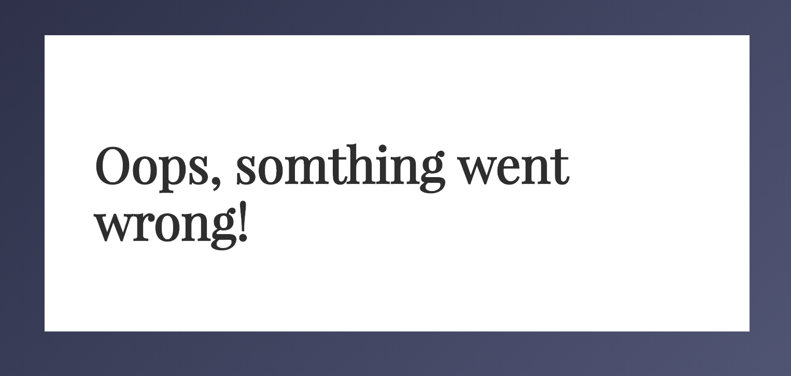
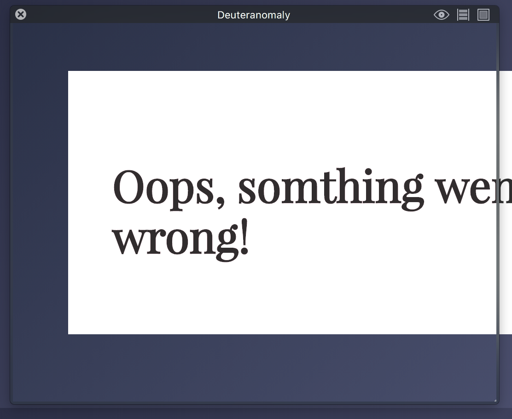

# Browser-Technologies Opdracht 1.
This app is made for  _trending_ gifs.
[Website](https://senmetsu.github.io/wafs/.)

## Description
I will make a list will contain some performance suggestions. `This` is gonna give the user a better experience.

## The list.
* Images
* Custom Fonts
* Javascript
* Color
* broadband
* Cookies
* localStorage
* Mouse/Trackpad.

## Images
The images are coming from an Api, unfortunately its not really useful to compress an incoming code from the third party.

## Custom Fonts
I'm not using any custom fonts. I've got the privilege from the google web fonts. :clap:

## Javascript

## Color
The contrast in my design is pretty strong.

## broadband
## Cookies
## localStorage
## Mouse/Trackpad

## Features
* [Routie](http://projects.jga.me/routie/)
* [Handlebars](http://handlebarsjs.com/)
