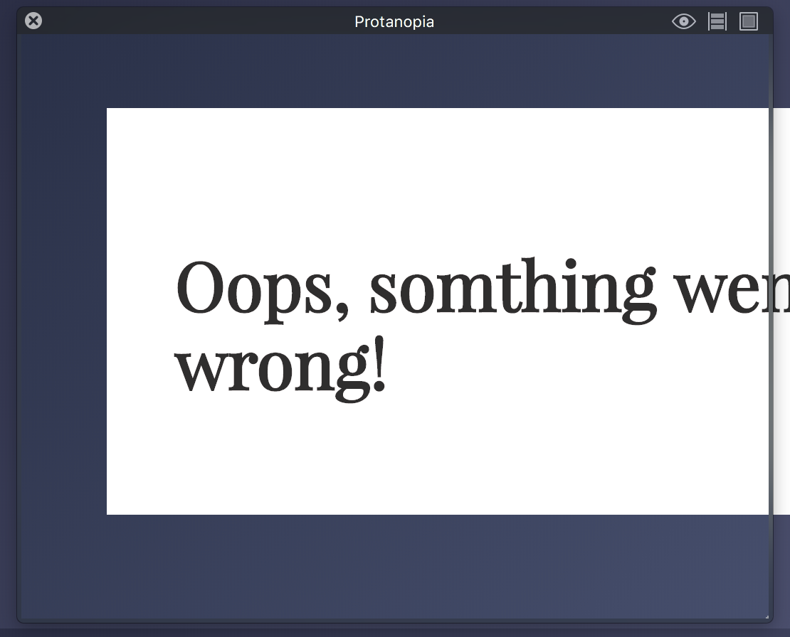
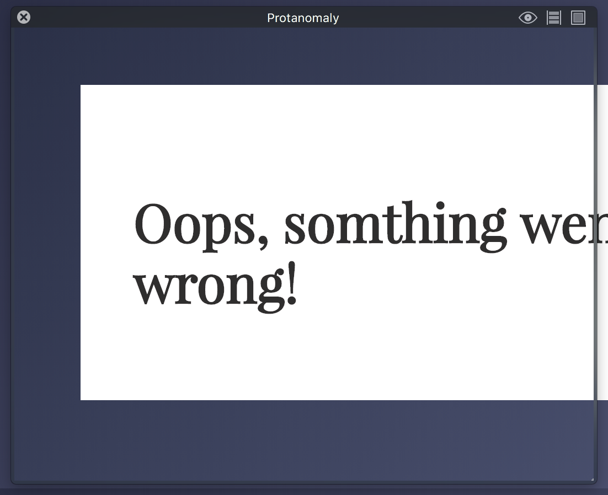
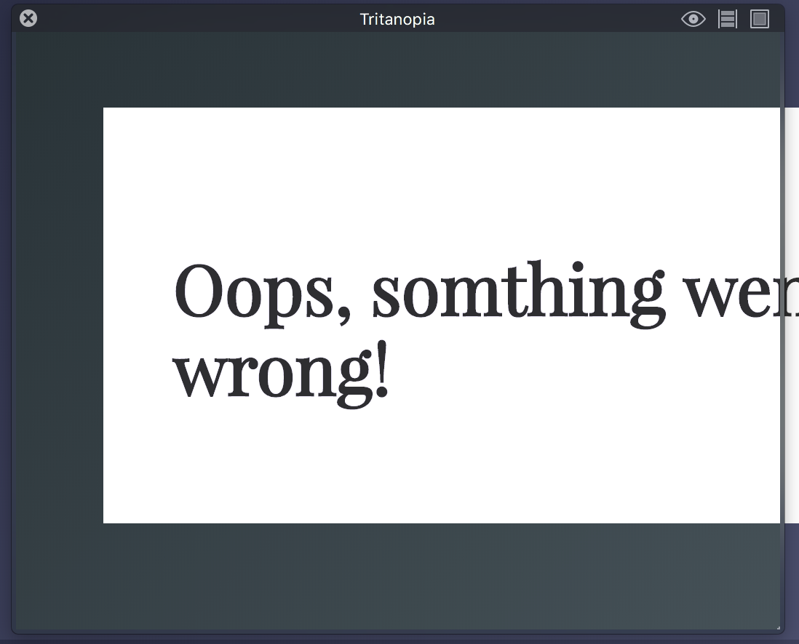

# Browser-Technologies Opdracht 1.
This app is made for  _trending_ gifs.
[Website](https://senmetsu.github.io/wafs/.)

## Description
I will make a list will contain some performance suggestions. `This` is gonna give the user a better experience.

## The list.
* Images
* Custom Fonts
* Javascript
* Color
* broadband
* Cookies
* localStorage
* Mouse/Trackpad.

## Images
The images are coming from an Api, unfortunately its not really useful to compress an incoming code from the third party.

## Custom Fonts
I'm not using any custom fonts. I've got the privilege from the google web fonts. :clap:

## Javascript
When you turn off javascript it won't work.  
This is because of the API. The api is gives all the data
we need.  

## Color
I've tested my
The contrast in my design is pretty strong.

## Broadband
Compression of the css and javascript will be usefull.
But we can't compress the images since this is from another party.

## Cookies
I'm not using cookies on this page :cross:
## localStorage

## Mouse/Trackpad
The site could use a bit more accessibility working with tabs.  
And make a better experience for people with a disability.

## Conclusion
There is a lot to do for improvement for this site.  
I want to figure out how much of the performance I can adjust.
