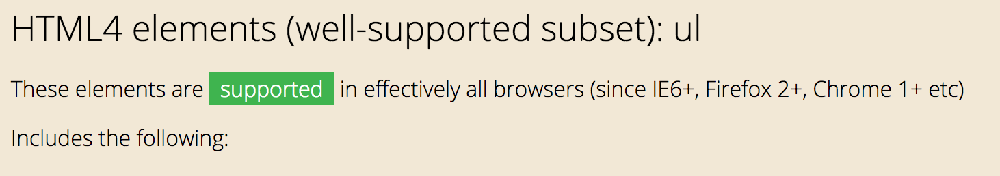
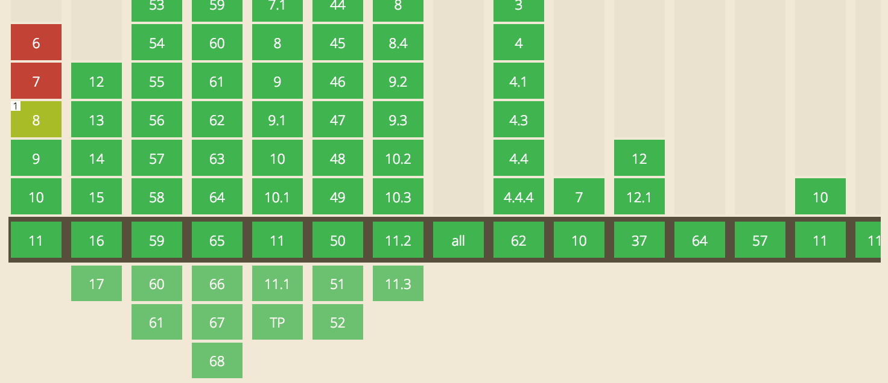
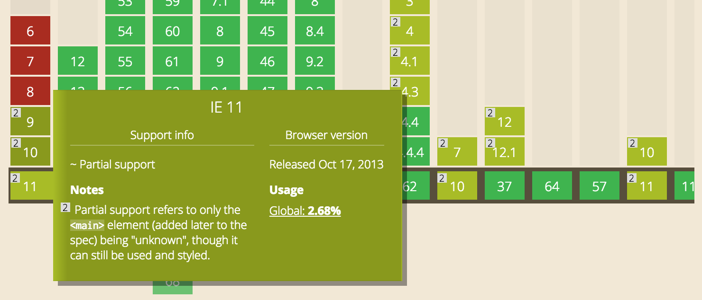
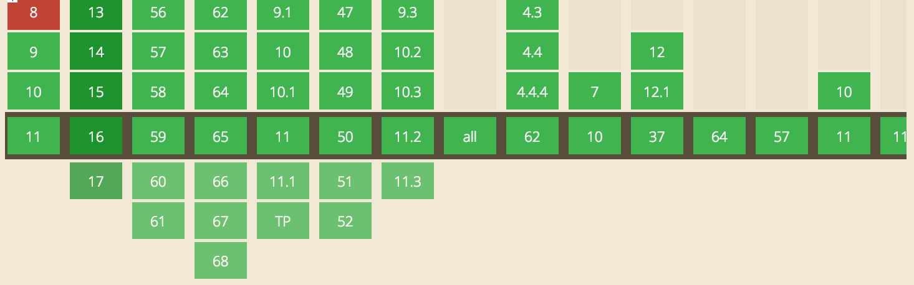

# Browser Technologies
Components for this assessment
* Carrousel
* Tabbladen

## Feature dectection
> Feature dectection involves working out whether a supports a certain block of code, and running a different code dependent on whether it does (or doesn't), so that the browser can always provide a working experience.

-[MDN](https://developer.mozilla.org/en-US/docs/Learn/Tools_and_testing/Cross_browser_testing/Feature_detection)

## Support
Not every HTML5 element is supported in the browsers.
### ul & li
`ul` & `li` are html 4 elements that are fully supported on browsers



`section` is an element that is not fully supported in every     browser such as IE other browsers do have a good support  on this element. section it still is 'cssable'(you can still  style the element.)



`figcaption` has the same issue as the `section`



`addEventListener` Is strongly supported in browsers, yet IE does it again.



## Fallback
### Javascript
With javascript I'm using the `addEventListener`, which is strongly supported but not for IE. This is why I got a fallback for it.

```javascript
for (i = 0; i < navtabs.length; i++) {
  if(window.addEventListener) {
    navtabs[i].addEventListener('click', function(event) {
      href = this.getAttribute('href')
      var cleanHref = href.replace('#', '')
      selectSection(cleanHref)
      event.preventDefault()
    })
  } else {
    navtabs[i].attachEvent('onclick', function(event) {
      href = this.getAttribute('href')
      var cleanHref = href.replace('#', '')
      selectSection(cleanHref)
      event.preventDefault()
    })
  }
}

```
### support
`@support` is a feature query. Feature query will check on the browser  support if you can use a css propperty.

#### Example
```css
@supports(scroll-behavior: smooth){
  html{
    scroll-behavior: smooth;
  }
}
```
## Testing


## Resources
* [diveintohtml5](http://diveintohtml5.info/detect.html)
* [quirksmode.org](https://www.quirksmode.org/js/support.html)
* [canIuse](https://caniuse.com/)
* [mdn](https://developer.mozilla.org/en-US/docs/Web/CSS/@supports)


Werk 2 componenten uit in een demo. Je onderzoekt hoe je verschillende features door verschillende browsers worden ondersteund en hoe je voor goede fallback kan zorgen. Gebruik [html5test.com](https://html5test.com), [css3test.com](http://css3test.com) en [kangax.github.io/compat-table/es6/](https://kangax.github.io/compat-table/es6/)

- Per feature: Zoek uit hoe je deze kunt testen. Verzamel uitleg en artikelen. Bouw een (kleine) progressive enhanced demo (zonder extra tools, gewoon in 1 HTML file, zo simpel mogelijk). Test de feature (en fallback) op verschillende browsers en het Device Lab. Let op: Gebruik van polyfills is niet toegestaan.
- Post je 2 demo’s op GitHub met uitleg in een README file. Wat is de feature? Welke browsers/devices ondersteunen deze wel/niet? Hoe zorg je dat de fallback nuttig is?

Beoordelingscriteria
- 2 componenten zijn onderzocht en er is een demo gemaakt.
- De code staat in een repository op GitHub.
- Een Readme is toegevoegd met, per feature:
  -	Een beschrijving van de feature.
  - Bronnen van uitleg en gebruikte artikelen.
  -	Welke browsers/devices ondersteunen deze wel/niet.
  -	Een beschrijving hoe de fallback werkt.
