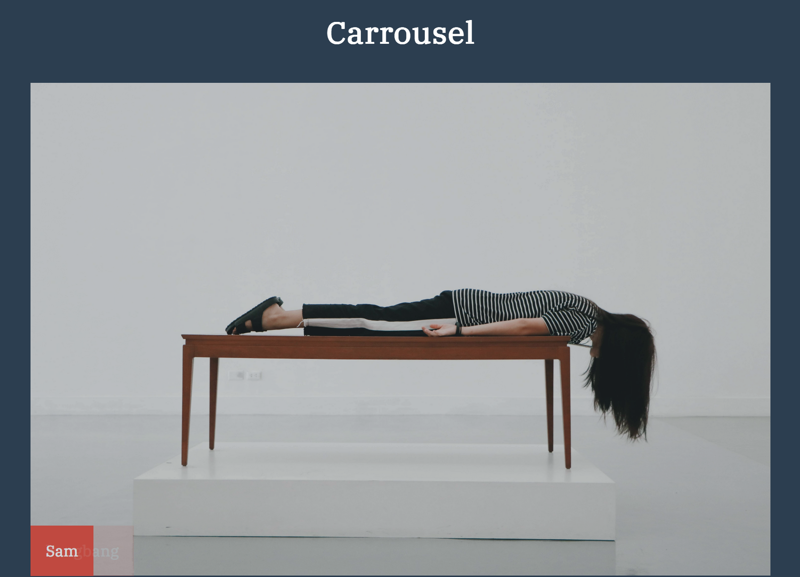
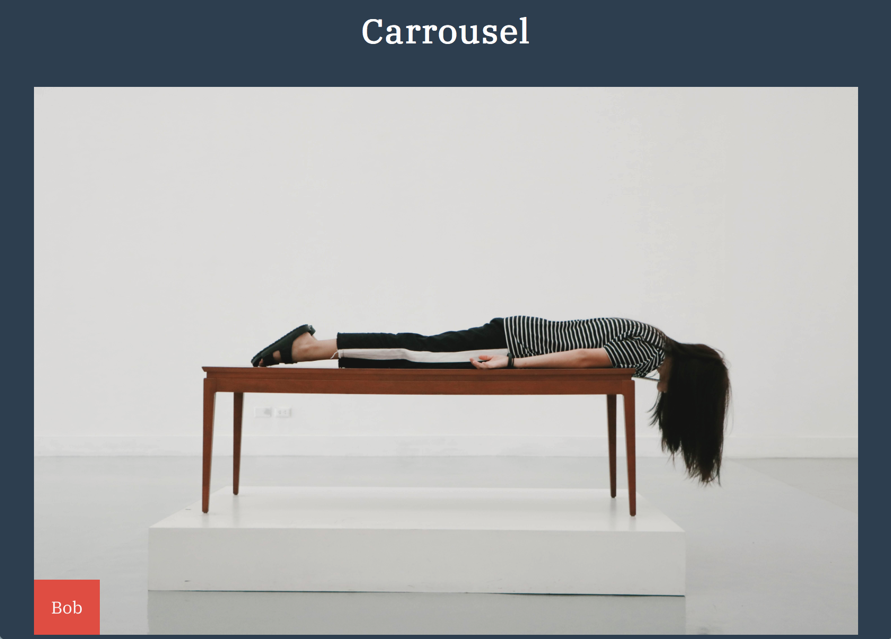
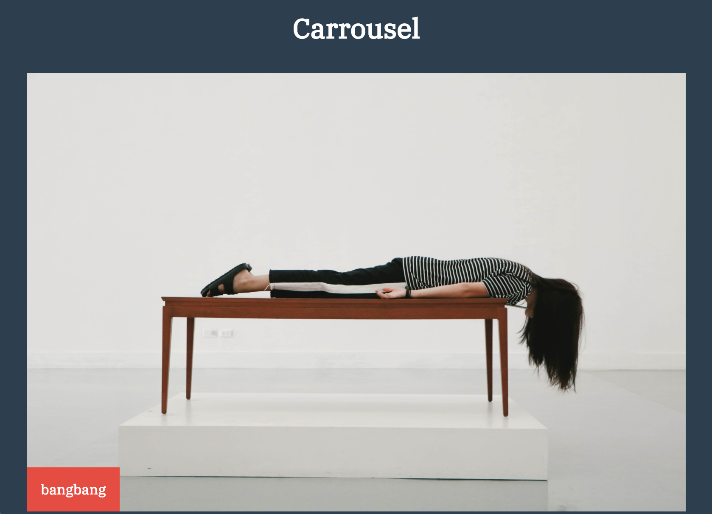

# Browser Technologies
Componenten die ik gemaakt heb.
* Carrousel
* Tabbladen

## Feature Detectie
//Wat laat je zien als een browser of gebruiker 'enhancement' niet kan tonen of zien? Hoe doe je Feature Detection en wat doe je als een techniek niet werkt?

### Carrousel
Chrome:  

Firefox:  

Safari:  

### Tabbladen

## Fallbacks

### Carrousel

### Tabbladen

## Testing

### Carrousel

### Tabbladen

Werk 2 componenten uit in een demo. Je onderzoekt hoe je verschillende features door verschillende browsers worden ondersteund en hoe je voor goede fallback kan zorgen. Gebruik [html5test.com](https://html5test.com), [css3test.com](http://css3test.com) en [kangax.github.io/compat-table/es6/](https://kangax.github.io/compat-table/es6/)

- Per feature: Zoek uit hoe je deze kunt testen. Verzamel uitleg en artikelen. Bouw een (kleine) progressive enhanced demo (zonder extra tools, gewoon in 1 HTML file, zo simpel mogelijk). Test de feature (en fallback) op verschillende browsers en het Device Lab. Let op: Gebruik van polyfills is niet toegestaan.
- Post je 2 demo’s op GitHub met uitleg in een README file. Wat is de feature? Welke browsers/devices ondersteunen deze wel/niet? Hoe zorg je dat de fallback nuttig is?

Beoordelingscriteria
- 2 componenten zijn onderzocht en er is een demo gemaakt.
- De code staat in een repository op GitHub.
- Een Readme is toegevoegd met, per feature:
  -	Een beschrijving van de feature.
  - Bronnen van uitleg en gebruikte artikelen.
  -	Welke browsers/devices ondersteunen deze wel/niet.
  -	Een beschrijving hoe de fallback werkt.
